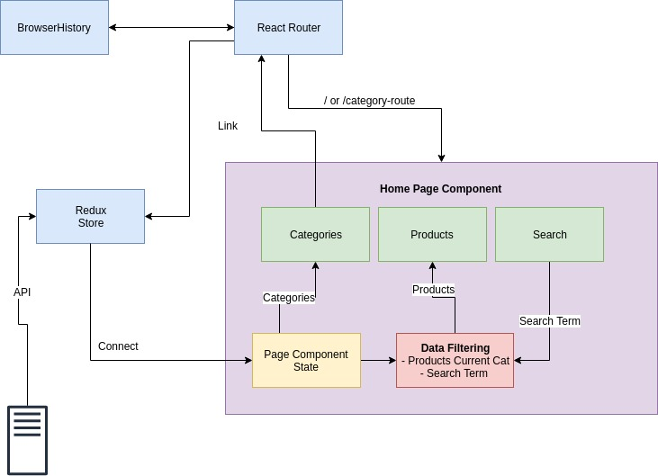

# Gousto coding test

## How to use
#### Starting the app in dev mode
```
 yarn start
```

Enable cors domain extension in chrome to allow API communication.
https://chrome.google.com/webstore/detail/moesif-orign-cors-changer/digfbfaphojjndkpccljibejjbppifbc


## Application structure


## Tests
```

CategoriesListing
  ✓ Renders without crashing the conrrect Block Element (.CategoriesListing) (1ms)
  AC
    ✓ renders a list (12ms)
    ✓ renders the correct amount of entries (4ms)
    ✓ renders the correct content (5ms)
    ✓ renders the correct link (2ms)

ProductListing
  ✓ Renders without crashing the conrrect Block Element (.ProductListing) (5ms)
  AC
    ✓ renders the correct amount of ProductTiles (35ms)
    ✓ handles no results  (8ms)

ProductTile
  ✓ Renders without crashing the conrrect Block Element (.ProductTile) (6ms)
  AC
    ✓ has a image  (36ms)
    ✓ has a title  (7ms)
    ✓ has a description  (7ms)
    ✓ has a price  (3ms)
    ✓ is description hidden (3ms)
    ✓ click on title will show description (7ms)


```

## Possible improvements/ functionality
- AC test around pages
- AC test end to end (selenium, webdriver)
- API pagination
- Image lazy loading on enter view port.
- Import Bootstrap from npm
- Create a Proxy server for API to remove cors issues on local development.
- Use CSS grid for card layout

---
# Original Requirements:
Hi there! We prepared a technical task so we can get to know you better. Below you will find scenarios and further details on what this task is about.

If anything is unclear or you have any questions, feel free to get back to us. We want to make our technical task a pleasant experience so feel free to give us any feedback on this exercise.

## How to use:

### Prerequisites:

* `node js` >= 8.12
* `yarn` (you can install it globally by running `npm install -g yarn`)

### Commands:

* `yarn install` - installing dependencies
* `yarn start` - starting the app in dev mode
* `yarn start-windows` - starting the app in dev mode on windows
* `yarn build` - build the production artifacts
* `yarn test` - running the tests

## How to deliver your assessment

* Please fork/clone this repository to your own version control platform (GitHub, GitLab, BitBucket, etc.)(public repo) and send us the link to it
* We will pay attention to the commits to see how the work was structured

## Functional requirements

### Task 1: As a user I want to see all available product categories

  * Given that I am a user
  * When I land on the main page
  * Then I can see the categories of products

### Task 2: As a user I want to see a list of products titles

  * Given that I am a user
  * When I land on the main page
  * Then I can see a list of products titles

### Task 3: As a user I want to see the products for the selected category

  * Given that I am a user
  * When I land on the main page view
  * And I click on 'Drinks Cabinet' category
  * Then I can see a list of products belonging to that category
  * And the selected category is bold

### Task 4: As a user I want to be able to search in the product title and description

  * Given that I am a user and I land on the 'Drinks Cabinet'
  * When I type ' serv' in the input searchCategotruesListing
  * Then the products matching the search input in title and/or description are shown below

### Task 5: As a user I want to be able to see the product description when I click on the product name

  * Given that I am a user and I land on main page
  * When I click on 'Borsao Macabeo'
  * Then I can see the description appearing below and the title is bold
  * When I click again on the 'Borsao Macabeo'
  * Then I can see that the description is hidden
  * When I click on multiple products
  * Then all the clicked products descriptions are visible

### Task 6: As a user I want to be able to navigate with the browser's native back and forward buttons

  * Given that I am a user
  * When I am on the 'Drinks Cabinet' category
  * And I click on 'Large Alcohol' category
  * Then I can click on the back button from the browser
  * And I can see the 'Drinks Cabinet' category selected
  * Then I click forward button
  * And I can see the 'Large Alcohol' category selected

#### API endpoints:

* To get the categories: https://api.gousto.co.uk/products/v2.0/categories
* To get the products: https://api.gousto.co.uk/products/v2.0/products?includes[]=categories&image_sizes[]=365
* For cross origin accessibility you can use [cross-fetch](https://www.npmjs.com/package/cross-fetch) that is already installed in package.json.
* If one of the first points are not working then use steps from this link :
`https://alfilatov.com/posts/run-chrome-without-cors/`

## Non-Functional Requirements

* UI should be built with React, but you are allowed to use additional other libraries if needed
* Use your preferred library for state management (Redux dependencies are already set up, but you can use what you want)
* Use your preferred CSS solution/library. Use your imagination, but do not spend to much time for css
* The application should be responsive (the application can be used on mobile)
* The code should include `test`
* The code should be production ready (no refactoring need)

## Help us to understand your solution

* In order to understand better you solution we would like to see the following sections in a Readme:
    * `How to use`: details about how to use your solution(if anything different from what we added)
    * `Application structure`: explain the architecture - feel free to change the base structure from this test
    * `A list of missing functional requirements`: if any, and explain why you didn't complete them
    * `Possible improvements/ functionality`: anything that you wished you could've added if you had more time

## Visuals


